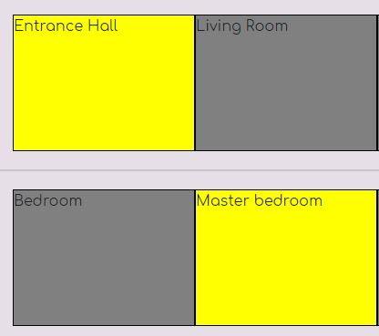
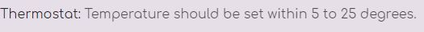
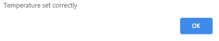

#######################################################

# Version Control
This Project uses Semantic Versioning (https://semver.org/) 
->0.0.15 -- Deployement section in README.md file expanded 
->0.0.14 -- Changed titles on subpages 
->0.0.13 -- Fixed Javascript code '==' changed for '===' 
->0.0.12 -- Fixed issue with logo not displaying properly on smaller devices 
->0.0.11 -- Fixed Issue with EmaiLJS (Panic button) function 
->0.0.10 -- Added User Experience Stories 
->0.0.9 -- Fixed * .html files for HTMLValidator 
->0.0.8 -- Fixed misspelling in plan.js 
->0.0.7 -- Fixed .css file for CSSValidator 
->0.0.6 -- Added screenshot.jpg file and testing write-up  
->0.0.5 -- Add acknowledgement to README.md file 
->0.0.4 -- Fixed bug on FAQ subsite when menu doesn't show up in proper width property. 
->0.0.3 -- Readme.md file updated for Version Control 
->0.0.2 -- Fixed Typos & Mispelling 
->0.0.1 -- Initial Commit 

# Project Info

HiVE Cluster - Smart Home Interface is a fully functional website that enables user to take control of his/her house.

System is just a proposition for the assignement @ www.CodeInstitute.Net and it only works as a presentation.

In the future if I have enough knowledge I might upgrade it towards existing system like: Amazon Alexa, Google Home etc...

# UX

Page is divided into 6 anchor point and gives user ability to go through different options in order to fully controll smarthome.

1) Main - Usefull information how the system work and describes all the functions available to the user.
2) House plan - Shows 2 floors and gives user ability to control each light in every room seperately and remotely.
3) Controls - enables user to setup the alarm, open garage or use lockdown mode to close every entrance to the house.
4) Emergency (Panic Button) - within one click our team would be informed that something is wrong or doesn't work withing your home.
5) Map - withing using of Google Maps would return the location of your home ()
6) FAQ - Frequently Asked Questions for general help or enquires.

a) Bill Smith wanted to remotely control lightning in his home. He always forgot to trip a switch when he leaves his home. To accomplish that he can use my website to remotely and independently control lighting in every room. 
b) Jonathan Mayers was tired of forgetting to switch on the alarm. He usually has to come back from time to time to set the alarm up. For the rescue come my website. He can do it now with on simply click on the website. 
c) Anna Jones was looking for a thermostat setup. She usually come back to her cold home and needed to set it up manually. The system proposed enables her that function to set up thermostat for designated temperature. 

# Testing

Website was tested using 3 devices: Desktop PC, Tablet (Samsung a300) and smartphone (Samsung s8). Website was also tested using Inspect function in Google Chrome 
HTML and CSS Validator were also used in place.

1) Thermostat setup was tested and it only allows user to use number from 5 to 25 (both inclusive) and verifies the input, other input would return an error to the user.

# Testing write-up

Test#1 As an example we are going to test Emergency function 

Steps Involved: 

1) Click on 'Emergency' Link located on Navigation Bar 
2) Click on 'Panic Button" located at the bottom of the page 
3) Pop-up window should appear and gives the user 2 options to choose: Close and Send Emergency 
4a) Click 'Close' to dismiss the window 
4b) Click 'Send Emergency" to inform the headquarter about some problems with the system. 
5) Click 'Close' to close the pop-up window 

Screenshot confirming that script is working: 

Test#2 Control of lighting at home: 

Steps Involved: 

1) Click on 'House Plan' link located on Navigation Bar 
2) Plan of house showes up and within one-click of a mouse button user can trigger it on or off. 
3) Gray background on the room represents light in off position 
4) Yellow background on the room represents light in on position 

Screenshot confirming that it is working: 
 

Test#3 Using Thermostat to set up desired temperature 

Steps Involved: 

1) Click on 'Controls' link located on Navigation Bar 
2) On the Control Panel on the right side of a page there is a field that can take any value from 5C degrees to 25C degrees. 
3a) If the value would be incorrect user would get an error message and the thermostat would not be set. 
3b) If the value is correct user would get informed that it is setup correctly 

Screenshot confirming 2 possible outcomes: 
 
 

# Deployement

Using Git Command Line to upload to a repository 

Type in terminal these commands: 
<code>git init</code> to initialize a new repository 
<code>git add README.md</code> to add README.md file to repository 
<code>git commit -m "Initial commit"</code> to add a message for first commitement. 
<code>git remote add origin https://github.com/bloobsky/your_repository_name.git</code> to assign repository 
<code>git push -u origin master</code> to upload files to the repository 
  

Project is deployed @ GitHub.  
Github was used in deployement process as it is integrated, simple and ther is no need to use additional services. 
It also containt Version Control and everything is uploaded using terminal commands (git) 

How it is done ?  

1) Open www.github.com.  
2) Login with your credentials  
3) On the Navigation Bar in the repository you would like to deploy look for 'settings' link.  
4) Scroll down the page and look for 'GitHub Pages' 
5) Under the source section select 'master branch' option 
6) Message should appear 'Your site is ready to be published at https://$YourLogin.github.io/$RepositoryName/ 
7) Your website is deployed now. 

# Technologies,Programming Languages and APIs

HTML5, CSS, BOOTSTRAP4, JavaScript, jQuery, FontAwesome, GoogleFonts 
API: emailJS and Google Maps API

# Features to be implemented

In the future upgrade it towards existing system like: Amazon Alexa, Google Home etc...

# Media

Bootstrap Icons used for a lock image (lock, unlock . svg) 
Swatch used for website is available at /img/swatch.png 
HiVE Cluster logo was created in Adobe Illustrator.  

# Acknowledgements

I received inspiration from CodeInstitute (www.codeinstitute.net) 
Privacy Policy was generated using www.iubenda.com 
Coolors.co - website was used to generate colour scheme. 
AWS Cloud9 was used to entirely written all the code for the proposed project.

