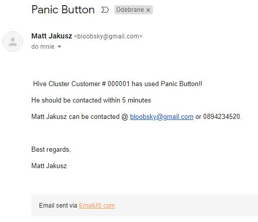

#######################################################

# Version Control
This Project uses Semantic Versioning (https://semver.org/) 

-0.0.6 -- Added screenshot.jpg file and testing write-up  
->0.0.5 -- Add acknowledgement to README.md file 
->0.0.4 -- Fixed bug on FAQ subsite when menu doesn't show up in proper width property. 
->0.0.3 -- Readme.md file updated for Version Control 
->0.0.2 -- Fixed Typos & Mispelling 
->0.0.1 -- Initial Commit 

# Project Info

HiVE Cluster - Smart Home Interface is a fully functional website that enables user to take control of his/her house.

System is just a proposition for the assignement @ www.CodeInstitute.Net and it only works as a presentation.

In the future if I have enough knowledge I might upgrade it towards existing system like: Amazon Alexa, Google Home etc...

# UX

Page is divided into 6 anchor point and gives user ability to go through different options in order to fully controll smarthome.

1) Main - Usefull information how the system work and describes all the functions available to the user.
2) House plan - Shows 2 floors and gives user ability to control each light in every room seperately and remotely.
3) Controls - enables user to setup the alarm, open garage or use lockdown mode to close every entrance to the house.
4) Emergency (Panic Button) - within one click our team would be informed that something is wrong or doesn't work withing your home.
5) Map - withing using of Google Maps would return the location of your home ()
6) FAQ - Frequently Asked Questions for general help or enquires.

# Testing

Website was tested using 3 devices: Desktop PC, Tablet (Samsung a300) and smartphone (Samsung s8). Website was also tested using Inspect function in Google Chrome 
HTML and CSS Validator were also used in place.

1) Thermostat setup was tested and it only allows user to use number from 5 to 25 (both inclusive) and verifies the input, other input would return an error to the user.

# Testing write-up

As an example we are going to test Emergency function 

Steps Involved: 

1) Click on 'Emergency' Link located on Navigation Bar 
2) Click on 'Panic Button" located at the bottom of the page 
3) Pop-up window should appear and gives the user 2 options to choose: Close and Send Emergency 
4a) Click 'Close' to dismiss the window 
4b) Click 'Send Emergency" to inform the headquarter about some problems with the system. 
5) Click 'Close' to close the pop-up window 

Screenshot confirming that script is working: 

# Deployement

Project is deployed @ GitHub.  
Github was used in deployement process as it is integrated, simple and ther is no need to use additional services. 
It also containt Version Control and everything is uploaded using terminal commands (git) 

# Technologies,Programming Languages and APIs

HTML5, CSS, BOOTSTRAP4, JavaScript, jQuery, FontAwesome, GoogleFonts 
API: emailJS and Google Maps API

# Features to be implemented

In the future upgrade it towards existing system like: Amazon Alexa, Google Home etc...

# Media

Bootstrap Icons used for a lock image (lock, unlock . svg) 
Swatch used for website is available at /img/swatch.png 
HiVE Cluster logo was created in Adobe Illustrator.  

# Acknowledgements

I received inspiration from CodeInstitute (www.codeinstitute.net) 
Privacy Policy was generated using www.iubenda.com 
Coolors.co - website was used to generate colour scheme. 
AWS Cloud9 was used to entirely written all the code for the proposed project.

